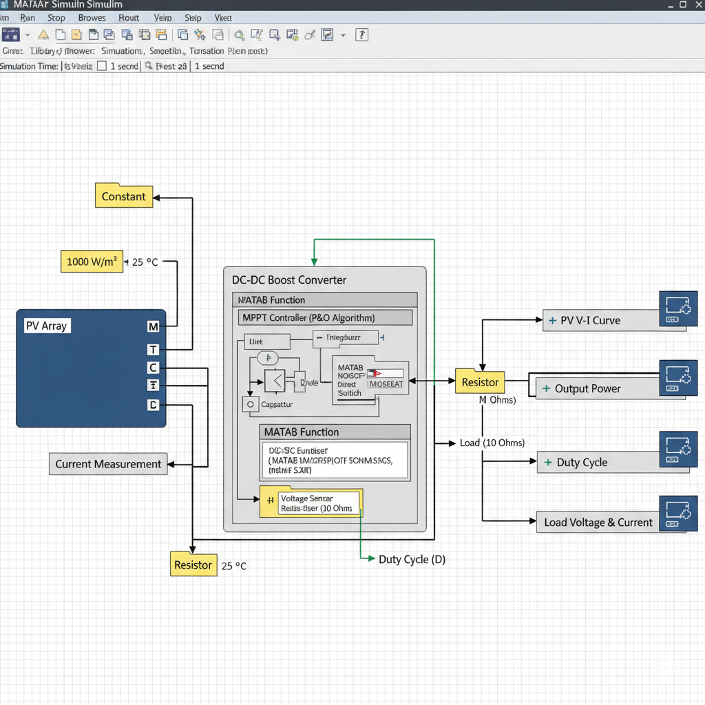

# ⚡ PV Induction Motor Pump System

A 10 kW photovoltaic (PV) driven induction motor pump system designed and simulated using MATLAB Simulink. The system integrates MPPT control, power electronics, and motor drive for efficient solar-powered water pumping.

---

## 🔍 Project Overview

This project focuses on designing a complete solar energy-based pumping system. It converts solar energy into electrical power and drives an induction motor pump using advanced control techniques.

---

## ⚙️ Key Features

* ☀️ 10 kW PV Array modeling
* 🔄 DC-DC Boost Converter
* 📈 MPPT using Perturb & Observe (P&O) algorithm
* 🔌 Voltage Source Inverter (VSI)
* ⚡ V/f control of induction motor
* 🚿 Pump load modeling

---

## 🧠 System Architecture

PV Array → Boost Converter → DC Link → Inverter → Induction Motor → Pump Load

---

## 📷 Model Structure

---

## 🛠️ Tools & Technologies

* MATLAB Simulink
* Simscape Electrical
* Control Systems

---

## 📊 Results

* Stable DC-link voltage (~640V)
* Efficient MPPT tracking
* Smooth motor operation with low harmonics
* Reliable system performance under simulation

---

## 📁 Files Included

* Simulink Model (.slx)
* MPPT Algorithm (.mlx)
* Project Report (PDF)
* Model Structure Image

---

## 🚀 Future Improvements

* Real-time implementation using hardware
* AI-based MPPT optimization
* Efficiency enhancement under varying conditions

---

## 👨‍💻 Author

Shilpi (Electrical Engineering)

---
